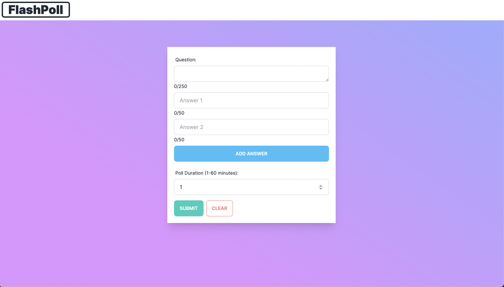

# Flash Poll

Welcome to Flash Poll, the quick and easy way to create and participate in polls! This app allows users to create polls with custom questions, answers, and set durations, as well as participate in real-time voting. Designed with a focus on simplicity and user experience, Flash Poll makes gathering opinions and insights fun and effortless.

## Demo Site 🏗️:

This [demo](https://flash-poll-app-2n3gt.ondigitalocean.app) is a work in progress.

## Features 🚀:

- [ ] App Level

  - [ ] Enhance mobile responsiveness
  - [ ] Cypress Testing
  - [ ] Expired Poll Page
  - [ ] Clean up DB after polls expire

- [ ] Poll Creation API

  - [x] Validation
  - [x] Link generation
  - [x] DB create resource
  - [x] Error logging
  - [x] Poll link JSON response
  - [ ] Unit tests

- [ ] Poll Creation Page:

  - [x] Form validation using native HTML methods
  - [x] Custom Question
  - [x] Custom Answers
  - [x] Add Additional Answers Fields
  - [x] Custom Duration
  - [x] Submit
  - [x] Clear Form
  - [x] Display errors if returned from API
  - [x] Redirect to poll link upon poll creation
  - [x] Unit tests

- [ ] Poll Voting Page

  - [x] Display question
  - [x] Display answers
  - [x] Display vote count on answers
  - [x] Unit tests
  - [ ] Add poll deletion button (if current user created it)
  - [ ] Display remaining voting time (duration)
  - [ ] Redirect to expired poll page if duration exceeded
  - [ ] Prevent multiple votes if same user
  - [ ] Web Sockets?

- [ ] Poll Voting API

  - [x] Voting request validation
  - [x] DB update resource
  - [ ] Error logging
  - [ ] Web Sockets?
  - [ ] Unit tests

## Built With 🛠

- `Next.js`, `React`, `TypeScript`, `Prisma`, `yup`, `Tailwind`, `PostgreSQL`, `DigitalOcean`

## Want to take a Test Drive? 🚙

Clone the repo and set up an `.env` file like the one provided. Then run `npm install && npm run dev`.

## Want to get in touch? 🤝

My contact information is at the bottom of [this page](https://hextobin.github.io/hextobin/).
